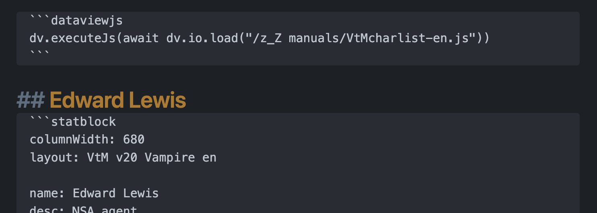

Some character sheets for World of Darkness (v20) characters, based on [Fantasy Statblocks](https://github.com/javalent/fantasy-statblocks) and [Obsidian](https://github.com/obsidianmd).
Currently there are **vampires**, **mortals**, **government agents** (mortal reskin actually, kinda based on 'Project Twilight') and **werewolves** (in progress).

# Description

This statblock contains custom layout (obviously), css snippet and js script. 

**Layout + CSS**
<br>
- the snippet stores all the graphic elements of the statblock - background textures, clan logos, etc.
- all dots and squares are shown using a few custom fonts (also sttored inside the snippet). Values from 0 to 9 can be easily displayed (in the most common cases, 5 or less are enough), but for "10" you must type "X" (if you don’t want to use the js script);
- the layouts supports [Dice Roller](https://github.com/javalent/dice-roller) plugin;
- internal links inside various lines (such as nature, demeanor, disciplines, flaws and merits) will be displayed as simple text, but still work;

**Javascript**
<br>
It adds a couple of simple visual tricks and also does some automation, just to simplify some things:
- you can add the name of your character in H2 above the statblock, and it will be hidden in reading view – but remains in the outline panel;
- change the clan image background according to the “Clan” property;
- “Blood per Turn” value will be calculated according to “Generation” property;
- all Attributes are equal to 1 by default; 
- if some traits have more than 5 dots, dots could be replaced with simple numbers, according to the length of the corresponding name; 
- if the path of your Kindred is Humanity, “Normalcy“ will be added as the bearing, with modifier. If it isn't, bearing line will be hidden;
- you can now set "10" property value as well, not "X";
- “Bloodpool” area will add new lines of squares if there are more blood than 10, 20, etc, up to 40 as max;
- “Weakness” is also filled automatically, according to the clan.

Almost all the things I mentioned could be done manually (except clan image, I suppose), so the script just automates some stuff.

> To run the script, you’ll need [Obsidian Dataview](https://github.com/blacksmithgu/obsidian-dataview) plugin. 

The design is based on the official Russian version of the character sheet. In general, Russian language is 30-40% longer than English, so the statblock could have been not so width… But not yet. 

## Some restrictions
This was started as small project for me and my friends only, so the final result is not really customisable at some points. For example, it’s made for 680px width, and cannot be split into two or more columns. On the other hand, I did my best to hide some rows or blocks if they are empty and/or not important – but you can change it in the layout.

And one final warning – I’m not a software developer at all, so css and js are full of sh#tcode :)

# General things

## Vampires
First of all, examples of VtM character sheets in English and Russian:

<p align="center">
    
    
</p>


Other charsheets are available at this moment in Russian only - but you can change the names of the abilities manually in Fantasy Statblocks settings and send me a pull request. Feel free to ask for any help!

## Werewolves, mortals and agents

Under the spoilers you can find all other charsheets.

<details>
    <summary>Werewolf (work in progress)</summary>
        <p align="center">
            
        </p>
</details>
<br>
<details>
    <summary>Mortal (close to the vampire charsheet)</summary>
        <p align="center">
            
        </p>
</details>
<br>
<details>
    <summary>"Project Twilight" agent - FBI, SAD, CIA, NSA...</summary>
        <p align="center">
            
        </p>
</details>

## Headers

There are also the option to add the top part of the charsheet as header of your note, in case you don't need all the stats of a character - just left all the fields below "image" blank, or add `cssclasses: wod-header` into your note's properties.
<br>
<details>
<br>
  <summary>Click here to see all headers</summary>
    <p align="center">
        
        
    </p>
    <p align="center">
        
        
    </p>
</details>

## Usage

What should you do to start using these statblocks?

1. Download json file for a needed character, `world-of-darkness-statblocks.css`, and `WoDCharsheets.js` (or `WoDCharsheets-en.js` for English version);
2. Install [Fantasy Statblocks](https://github.com/javalent/fantasy-statblocks) plugin and enable it;
3. Go to Fantasy Statblocks and upload the json using "Import From JSON" button. The new layout must appear in the list below.
4. Copy `world-of-darkness-statblocks.css` into your Obsidian "snippets" folder, then go to Obsidian's Apperance settings and enable it;
5. Copy `WoDCharsheets.js` (or `WoDCharsheets-en.js`) **into the folder inside your Obsidian vault**;
6. Install [Obsidian Dataview](https://github.com/blacksmithgu/obsidian-dataview) plugin and enable it;
7. Create a new note;
8. At the beginning of a note, add:
````
```dataviewjs
dv.executeJs(await dv.io.load("/z_Z manuals/WoDCharsheets.js"))
```
````
`"/z_Z manuals/WoDCharsheets.js"` - it's my path to js file inside my Obsidian vault, you must replace it with your own.

9. Copy the blank layout of your character from below and paste it into your note;
10.   Done! Now you can start filling a charsheet!

<p align="center">
    
</p>

<details>
    <summary>Vampire (English)</summary>

    ```statblock
    columnWidth: 680
    column: 1
    layout: VtM v20 Vampire
    dice: true

                            #### GENERAL INFO ####

    name: 
    desc: 
    clan: 
    generation: 
    sire: 
    nature: 
    demeanor: 
    concept: 

    img: 
    img_title: 
    img_alt: 
    img_alt_title: 

                            #### Attributes ####

    Attributes: Attributes

    Physical: Physical
    Strength: 0
    Dexterity: 0
    Stamina: 0

    Social: Social
    Charisma: 0
    Manipulation: 0
    Appearance: 0

    Mental: Mental
    Perception: 0
    Intelligence: 0
    Wits: 0

                                #### Abilities ####

    Abilities: Abilities

    Talents: Talents
    alertness: 0
    athletics: 0
    awareness: 0
    brawl: 0
    empathy: 0
    expression: 0
    intimidation: 0
    leadership: 0
    streetwise: 0
    subterfuge: 0
    new_talent: 
    new_talent_value: 

    Skills: Skills
    animalken: 0
    crafts: 0
    drive: 0
    etiquette: 0
    firearms: 0
    larceny: 0
    melee: 0
    performance: 0
    stealth: 0
    survival: 0
    new_skill: 
    new_skill_value: 

    Knowledges: Knowledges
    academics: 0
    computer: 0
    finance: 0
    investigation: 0
    law: 0
    medicine: 0
    occult: 0
    politics: 0
    science: 0
    technology: 0
    new_knowledge: 
    new_knowledge_value: 

                                #### Advantages #### 

    Advantages: Advantages

    Disciplines: DISCIPLINES
    discipline1_name: 
    discipline1_value: 
    discipline2_name: 
    discipline2_value: 
    discipline3_name: 
    discipline3_value: 
    discipline4_name: 
    discipline4_value: 
    discipline5_name: 
    discipline5_value: 
    discipline6_name: 
    discipline6_value: 

    Backgrounds: BACKGROUNDS
    background1_name: 
    background1_value: 
    background2_name: 
    background2_value: 
    background3_name: 
    background3_value: 
    background4_name: 
    background4_value: 
    background5_name: 
    background5_value: 
    background6_name: 
    background6_value: 

    Virtues: VIRTUES
    conscience: 0
    selfcontrol: 0
    courage: 0

                        #### ДОСТОИНСТВА / НЕДОСТАТКИ ####

    Merits: MERITS
    merit1_name: 
    merit1_value: 
    merit2_name: 
    merit2_value: 
    merit3_name: 
    merit3_value: 
    merit4_name: 
    merit4_value: 
    merit5_name: 
    merit5_value: 
    merit6_name: 
    merit6_value: 

    Flaws: FLAWS
    flaw1_name: 
    flaw1_value: 
    flaw2_name: 
    flaw2_value: 
    flaw3_name: 
    flaw3_value: 
    flaw4_name: 
    flaw4_value: 
    flaw5_name: 
    flaw5_value: 
    flaw6_name: 
    flaw6_value: 

                        #### PATH / WILLPOWER / BLOOD ####

    path: HUMANITY
    path_value: 

    willpower: WILLPOWER
    willpower_main: 
    willpower_current: 

    bloodpool: BLOODPOOL
    blood: 

    Health: HEALTH
    aggravated: 
    lethal: 
    bashing: 

    Specialties: SPECIALTIES
    specialty1_origin: 
    specialty1_name: 
    specialty2_origin: 
    specialty2_name: 
    specialty3_origin: 
    specialty3_name: 
    specialty4_origin: 
    specialty4_name: 
    specialty5_origin: 
    specialty5_name: 
    specialty6_origin: 
    specialty6_name: 

    show_weakness: no

</details>

<br>

<details>
    <summary>Werewolf (Russian)</summary>

    ```statblock
    columnWidth: 680
    column: 1
    layout: WtA v20 Werewolf
    dice: true

                            #### ОСНОВНАЯ ИНФОРМАЦИЯ ####

    name: 
    desc: 
    breed: 
    auspice: 
    tribe: 
    pack_name: 
    totem: 
    nature: 
    demeanor: 
    concept: 

    img: 
    img_title: 
    img_alt: 
    img_alt_title: 

                                #### ХАРАКТЕРИСТИКИ ####

    Attributes: Характеристики

    Physical: ФИЗИЧЕСКИЕ
    Strength: 0
    Dexterity: 0
    Stamina: 0

    Social: СОЦИАЛЬНЫЕ
    Charisma: 0
    Manipulation: 0
    Appearance: 0

    Mental: МЕНТАЛЬНЫЕ
    Perception: 0
    Intelligence: 0
    Wits: 0

                                #### СПОСОБНОСТИ ####

    Abilities: Способности

    Talents: ТАЛАНТЫ
    athletics: 0 # Атлетика
    alertness: 0 # Бдительность
    brawl: 0 # Драка
    intimidation: 0 # Запугивание
    expression: 0 # Красноречие
    leadership: 0
    primalurge: 0 # Первобытный инстинкт
    streetwise: 0 # Уличное чутье
    subterfuge: 0 # Хитрость
    empathy: 0
    new_talent: 
    new_talent_value: 

    Skills: НАВЫКИ
    drive: 0
    larceny: 0 # Воровство
    survival: 0
    performance: 0
    animalken: 0
    crafts: 0
    stealth: 0
    firearms: 0
    melee: 0
    etiquette: 0
    new_skill:
    new_skill_value:

    Knowledges: ЗНАНИЯ
    academics: 0
    science: 0
    enigmas: 0 # Загадки
    law: 0
    computer: 0
    medicine: 0
    occult: 0
    rituals: 0 # Ритуалы
    investigation: 0
    technology: 0
    new_knowledge:
    new_knowledge_value:

                            #### ПРЕИМУЩЕСТВА ####

    Advantages: Преимущества

    Backgrounds: ФАКТЫ  БИОГРАФИИ
    background1_name: 
    background1_value: 
    background2_name: 
    background2_value: 
    background3_name: 
    background3_value: 
    background4_name: 
    background4_value: 
    background5_name: 
    background5_value: 
    background6_name: 
    background6_value: 

    Gifts: ДАРЫ
    gift1: 
    gift2: 
    gift3: 
    gift4: 
    gift5: 
    gift6: 
    gift7: 
    gift8: 
    gift9: 
    gift10: 

                        #### ДОСТОИНСТВА / НЕДОСТАТКИ ####

    where-to-show-merits-and-flaws: right

    Merits: ДОСТОИНСТВА
    merit1_name: 
    merit1_value: 
    merit2_name: 
    merit2_value: 
    merit3_name: 
    merit3_value: 
    merit4_name: 
    merit4_value: 
    merit5_name: 
    merit5_value: 

    Flaws: НЕДОСТАТКИ
    flaw1_name: 
    flaw1_value: 
    flaw2_name: 
    flaw2_value: 
    flaw3_name: 
    flaw3_value: 
    flaw4_name: 
    flaw4_value: 
    flaw5_name: 
    flaw5_value:

                            #### ПОЧЕТ / ВОЛЯ / ЗДОРОВЬЕ ####

    Renown: Почет

    glory: Слава
    glory_main: 0
    glory_current: 0

    honor: Честь
    honor_main: 0
    honor_current: 0

    wisdom: Мудрость
    wisdom_main: 0
    wisdom_current: 0


    rage: Ярость
    rage_main: 0
    rage_current: 0

    gnosis: Гнозис
    gnosis_main: 0
    gnosis_current: 0

    willpower: Воля
    willpower_main: 0
    willpower_current: 0


    Health: Здоровье
    aggravated: 
    lethal: 
    bashing: 

    Specialties: 
    specialty1_origin: 
    specialty1_name: 
    specialty2_origin: 
    specialty2_name: 
    specialty3_origin: 
    specialty3_name: 
    specialty4_origin: 
    specialty4_name: 
    specialty5_origin: 
    specialty5_name: 
    specialty6_origin: 
    specialty6_name: 
    ```

</details>

<br>

<details>
    <summary>Mortal (Russian)</summary>

    ```statblock
    columnWidth: 680
    column: 1
    layout: WoD v20 Mortal
    dice: true

                            #### ОСНОВНАЯ ИНФОРМАЦИЯ ####

    name: 
    desc: 
    nature: 
    demeanor: 
    concept: 

    img: 
    img_title: 
    img_alt: 
    img_alt_title: 

                            #### ХАРАКТЕРИСТИКИ ####

    Attributes: Характеристики

    Physical: ФИЗИЧЕСКИЕ
    Strength: 0
    Dexterity: 0
    Stamina: 0

    Social: СОЦИАЛЬНЫЕ
    Charisma: 0
    Manipulation: 0
    Appearance: 0

    Mental: МЕНТАЛЬНЫЕ
    Perception: 0
    Intelligence: 0
    Wits: 0

                                #### СПОСОБНОСТИ ####

    Abilities: Способности

    Talents: ТАЛАНТЫ
    athletics: 0 # Атлетика
    alertness: 0 # Бдительность
    brawl: 0 # Драка
    intimidation: 0 # Запугивание
    expression: 0 # Красноречие
    leadership: 0
    streetwise: 0 # Уличное чутье
    subterfuge: 0 # Хитрость
    awareness: 0 # Шестое чувство
    empathy: 0
    new_talent: 
    new_talent_value: 

    Skills: НАВЫКИ
    drive: 0
    larceny: 0 # Воровство
    survival: 0
    performance: 0
    animalken: 0
    crafts: 0
    stealth: 0
    firearms: 0
    melee: 0
    etiquette: 0
    new_skill: 
    new_skill_value: 

    Knowledges: ЗНАНИЯ
    academics: 0
    science: 0
    law: 0
    computer: 0 # Информатика
    medicine: 0
    occult: 0
    politics: 0
    investigation: 0
    finance: 0
    technology: 0 # Электроника
    new_knowledge:
    new_knowledge_value:

                                #### ПРЕИМУЩЕСТВА ####

    Advantages: Преимущества

    Disciplines: ДАРЫ И ПАРАМЕТРЫ
    discipline1_name: 
    discipline1_value: 
    discipline2_name: 
    discipline2_value: 
    discipline3_name: 
    discipline3_value: 
    discipline4_name: 
    discipline4_value: 
    discipline5_name: 
    discipline5_value: 
    discipline6_name: 
    discipline6_value: 

    Backgrounds: ФАКТЫ  БИОГРАФИИ
    background1_name: 
    background1_value: 
    background2_name: 
    background2_value: 
    background3_name: 
    background3_value: 
    background4_name: 
    background4_value: 
    background5_name: 
    background5_value: 
    background6_name: 
    background6_value: 

    Virtues: ДОБРОДЕТЕЛИ
    conscience: 0
    selfcontrol: 0
    courage: 0

                        #### ДОСТОИНСТВА / НЕДОСТАТКИ ####

    Merits: ДОСТОИНСТВА
    merit1_name: 
    merit1_value: 
    merit2_name: 
    merit2_value: 
    merit3_name: 
    merit3_value: 
    merit4_name: 
    merit4_value: 
    merit5_name: 
    merit5_value: 
    merit6_name: 
    merit6_value: 

    Flaws: НЕДОСТАТКИ
    flaw1_name: 
    flaw1_value: 
    flaw2_name: 
    flaw2_value: 
    flaw3_name: 
    flaw3_value: 
    flaw4_name: 
    flaw4_value: 
    flaw5_name: 
    flaw5_value: 
    flaw6_name: 
    flaw6_value: 

                        #### ЧЕЛОВЕЧНОСТЬ / ВОЛЯ / ЗДОРОВЬЕ ####

    humanity: ЧЕЛОВЕЧНОСТЬ
    humanity_value: 0

    willpower: ВОЛЯ
    willpower_main: 0
    willpower_current: 0 

    Health: ЗДОРОВЬЕ
    bashing: 0
    lethal: 0

                                #### СПЕЦИАЛИЗАЦИЯ ####

    Specialties: Специализация
    specialty1_origin: 
    specialty1_name: 
    specialty2_origin: 
    specialty2_name: 
    specialty3_origin: 
    specialty3_name: 
    specialty4_origin: 
    specialty4_name: 
    specialty5_origin: 
    specialty5_name: 
    specialty6_origin: 
    specialty6_name: 

                                    #### ОРУЖИЕ ####

    weapon1_name: пистолет
    damage1: 4
    range1: 20
    firerate1: 4
    clip1: 15
    conceal1: ПК
    ```

</details>

<br>

<details>
    <summary>Agents (Russian)</summary>

    ```statblock
    column: 1
    columnWidth: 680
    layout: WoD v20 Agent
    dice: true

                            #### ОСНОВНАЯ ИНФОРМАЦИЯ ####

    name: 
    desc: 
    nature: 
    demeanor: 
    concept: 
    agency: 
    rank: 
    codename: 

    img: 
    img_title: 
    img_alt: 
    img_alt_title: 

                            #### ХАРАКТЕРИСТИКИ ####

    Attributes: Характеристики

    Physical: ФИЗИЧЕСКИЕ
    Strength: 0
    Dexterity: 0
    Stamina: 0

    Social: СОЦИАЛЬНЫЕ
    Charisma: 0
    Manipulation: 0
    Appearance: 0

    Mental: МЕНТАЛЬНЫЕ
    Perception: 0
    Intelligence: 0
    Wits: 0

                                #### СПОСОБНОСТИ ####

    Abilities: Способности

    Talents: ТАЛАНТЫ
    athletics: 0 # Атлетика
    alertness: 0 # Бдительность
    brawl: 0 # Драка
    intimidation: 0 # Запугивание
    expression: 0 # Красноречие
    leadership: 0
    streetwise: 0 # Уличное чутье
    subterfuge: 0 # Хитрость
    awareness: 0 # Шестое чувство
    empathy: 0
    new_talent: 
    new_talent_value: 

    Skills: НАВЫКИ
    drive: 0
    larceny: 0 # Воровство
    survival: 0
    performance: 0
    animalken: 0
    crafts: 0
    stealth: 0
    firearms: 0
    melee: 0
    etiquette: 0
    new_skill: 
    new_skill_value: 

    Knowledges: ЗНАНИЯ
    academics: 0
    science: 0
    law: 0
    computer: 0 # Информатика
    medicine: 0
    occult: 0
    politics: 0
    investigation: 0
    finance: 0
    technology: 0 # Электроника
    new_knowledge: 
    new_knowledge_value: 

                                #### ПРЕИМУЩЕСТВА ####

    Advantages: Преимущества

    Backgrounds: ФАКТЫ  БИОГРАФИИ
    background1_name: 
    background1_value: 
    background2_name: 
    background2_value: 
    background3_name: 
    background3_value: 
    background4_name: 
    background4_value: 
    background5_name: 
    background5_value: 

    Virtues: ДОБРОДЕТЕЛИ
    conscience: 0
    selfcontrol: 0
    courage: 0

                        #### ДОСТОИНСТВА / НЕДОСТАТКИ ####

    Merits: ДОСТОИНСТВА
    merit1_name: 
    merit1_value: 
    merit2_name: 
    merit2_value: 
    merit3_name: 
    merit3_value: 
    merit4_name: 
    merit4_value: 

    Flaws: НЕДОСТАТКИ
    flaw1_name: 
    flaw1_value: 
    flaw2_name: 
    flaw2_value: 
    flaw3_name: 
    flaw3_value: 
    flaw4_name: 
    flaw4_value: 
    flaw5_name: 
    flaw5_value: 
    flaw6_name: 
    flaw6_value: 
    flaw7_name: 
    flaw7_value: 


                        #### ЧЕЛОВЕЧНОСТЬ / ВОЛЯ / ЗДОРОВЬЕ ####


    humanity: ЧЕЛОВЕЧНОСТЬ
    humanity_value: 0

    willpower: ВОЛЯ
    willpower_main: 0
    willpower_current: 0

    Health: здоровье
    bashing: 0
    lethal: 0

                                #### СПЕЦИАЛИЗАЦИЯ ####

    Specialties: Специализация
    specialty1_origin: 
    specialty1_name: 
    specialty2_origin: 
    specialty2_name: 
    specialty3_origin: 
    specialty3_name: 
    specialty4_origin: 
    specialty4_name: 
    specialty5_origin: 
    specialty5_name: 
    specialty6_origin: 
    specialty6_name: 
    ```

</details>

## FAQ

**Q**: Why should I run the script from unknown guy's github?
<br>
**A**: In general, you can use only css file. Without it you:
- lose clan's logos;
- must use 'X' as replacement to '10';
- need to manually add `bearing`, `blood_per_turn` and `blood_current` properties.

**Q**: When I add the layout into Fantasy Statblock, I see warning about Javascript code! What's this?
<br>
**A**: The layout has some code inside, to used with [Dice Roller](https://github.com/javalent/dice-roller) plugin. 

**Q**: My statblock doesn't have fonts I see on your screenshots. 
<br>
**A**: I can't add these fonts into the statblock because of legal reasons. But you can add them manually into your system, and then the statblock will use them.<br>
For vampires and mortals you'll need Marta and Trajan Pro 3.<br>
For werewolves - Marta and KistyCC.<br>
For agents - GNUTypewriter.<br>
Also, this statblock supports the great [Style Settings](https://github.com/mgmeyers/obsidian-style-settings/) plugin, so you can choose other fonts there, if you want.
<p align="center">
    
</p>

<!--
**Q**: Allright, I did it, but still can't see the fonts on my mobile!
<br>
**A**: -->

**Q**: Weakness of my vampire is empty! 
<br>
**A**: That's because I can't include long quotation from the rulebook. There is the place for them at the beginning of the js script, like `const weaknessBrujah = '';`. Open the script with a notepad and add the weakness between quotes.

**Q**: C'mon, 10mb css file? Why it is so huge?
<br>
**A**: That's because it stores the graphic elements (in base64 strings) for all the statblocks, especially background testures. I placed all these elements in the end of the file and divided their blocks with comments like `/*  ALL THE GRAPHIC FOR AGENTS  */`. If you aren't going to use, for example, agents, open the css snippet in notepad and remove such block. 

## Epilogue 
Well, that’s all, folks! Please let me know what do you think about this layout, and how it can be improved. For example, still not sure about the way the Specialties are displayed, but can’t think up something better.
I also a little bit sad that, in general, this layout is just an info page. Storytelling System assumes that you combine two of your stats, Intelligence + Academics, for example, and then roll all the dice. If you know how it can be achieved – please let me know!