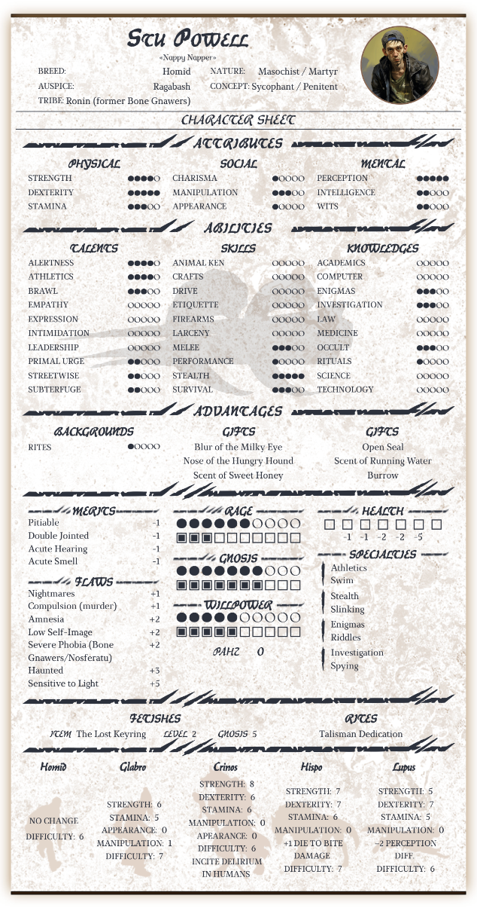
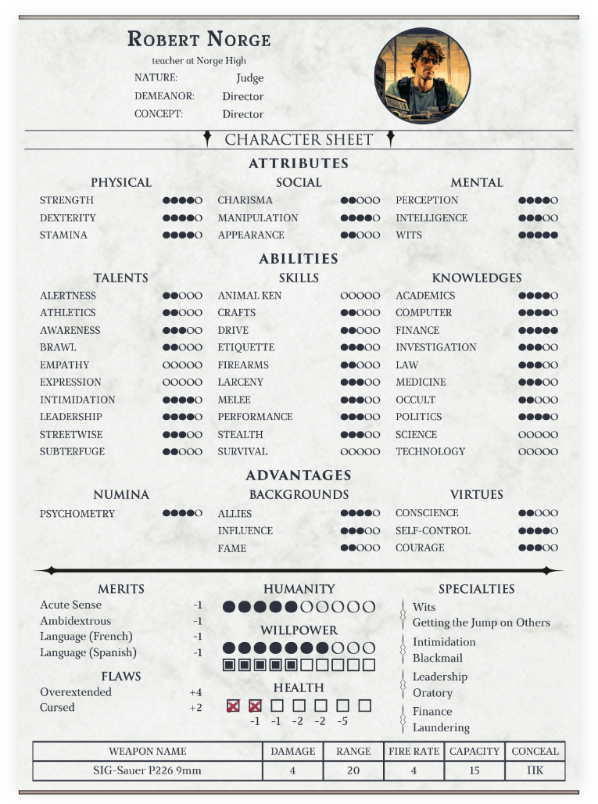
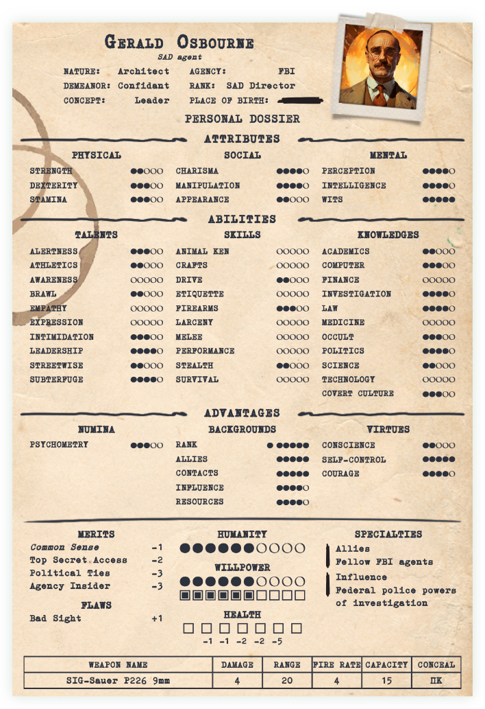
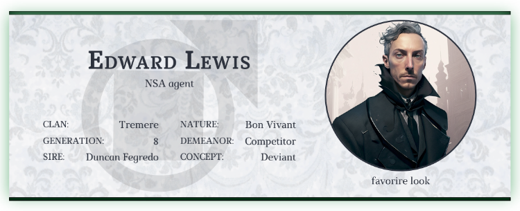
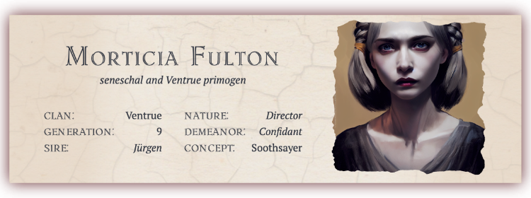
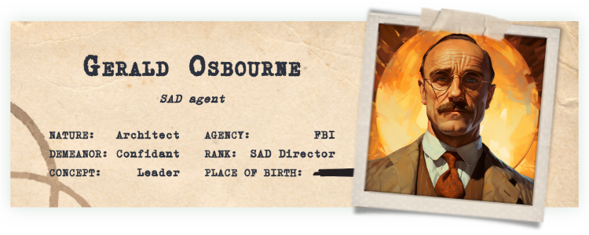
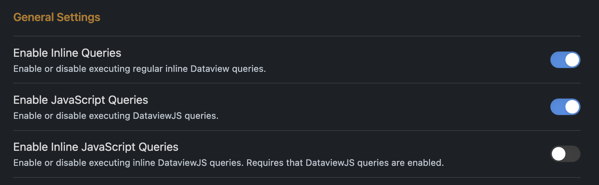

Some character sheets for World of Darkness (20th Anniversary Edition) characters, based on [Fantasy Statblocks](https://github.com/javalent/fantasy-statblocks) and [Obsidian](https://github.com/obsidianmd).
Currently, there are **vampires** (modern nights and dark ages), **werewolves**, **mortals** and **government agents** (mortal reskin actually, kinda based on 'Project Twilight').

<p align="center">
    <a style='text-decoration: none' href="README.ru.md"></a>
</p>

# General things

## Vampires
First of all, examples of VtM character sheets:

<p align="center">
    <a href='imgs/vampire_en.png'></a>
    <a href='imgs/vampire_dark_ages_en.png'></a>
</p>

## Werewolves, mortals and agents

Under the spoilers, you can find all other charsheets.

<details>
    <summary>Werewolf</summary>
        <p align="center">
            <a href='imgs/werewolf_en.png'></a>
        </p>
</details>

<details>
    <summary>Mortal (similar to the vampire charsheet)</summary>
        <p align="center">
            <a href='imgs/mortal_en.png'></a>
        </p>
</details>

<details>
    <summary>"Project Twilight" agent - FBI, SAD, CIA, NSA...</summary>
        <p align="center">
            <a href='imgs/agent_en.png'></a>
        </p>
</details>

## Headers

There is also the option to add the top part of the charsheet as a header of your note, in case you don't need all the stats of a character - just leave all the fields below image block blank, or add `cssclasses: wod-header` into your note's properties.

<p align="center">
    
    
</p>
<p align="center">
    
    
</p>
<p align="center">
    
</p>

# Description

This statblock contains the custom layout JSON (obviously), CSS snippet and JS script. 

**JSON + CSS**
<br>

- the snippet stores all the graphic elements of the statblock - background textures, clan and tribe logos, some fonts, etc;
- all dots and squares are shown using a few custom fonts (also stored inside the snippet). Values from 0 to 9 can be easily displayed (in the most common cases, 5 or less are enough), but for "10" you must type "X" (if you don’t want to use the JS script);
- the layouts support [Dice Roller](https://github.com/javalent/dice-roller) plugin;
- internal links inside various lines (such as nature, demeanor, disciplines, flaws and merits) will be displayed as simple text, but still work.

**Javascript**
<br>

It adds a couple of simple visual tricks and also does some automation, just to simplify some things;
- you can add the name of your character in H2 above the statblock, and it will be hidden in the reading view – but it remains in the outline panel;
- add the background image according to the “Clan” or "Tribe" property;
- “Weakness” is also filled automatically, according to the clan.
- The “Blood per Turn” value will be calculated according to the “Generation” property;
- all Attributes are equal to 1 by default; 
- if some traits have more than 5 dots, dots could be replaced with simple numbers, according to the length of the respective name, for saving the design's beauty; 
- if the path of your Kindred is Humanity, “Normalcy“ will be added as the bearing, with the modifier. If it isn't, the bearing line will be hidden;
- you can now set "10" property value as well, not "X";
- The “Bloodpool” area will add new lines of squares if there are more blood than 10, 20, etc, up to 40 as max;

Almost all the things I mentioned could be done manually (except clan\tribe image, I suppose), so the script just automates some stuff.

> To run the script, you’ll need [Obsidian Dataview](https://github.com/blacksmithgu/obsidian-dataview) plugin. 

The design is based on the official Russian version of the character sheet. In general, the Russian language is 30-40% longer than English, so the statblock could have been not so wide… But not yet. 

## Some restrictions
This was started as a small project for me and my friends only, so the final result is not customizable at some points. For example, it’s made for 680px width, and cannot be split into two or more columns. On the other hand, I did my best to hide some rows or blocks if they are empty and/or not important – but you can change it in the layout.

And one final warning – I’m not a software developer at all, so CSS and JS files are full of sh#tcode :)

# Usage

## What should you do to start using these statblocks?

1. Download `world-of-darkness-statblocks.css`, `WoDCharsheets-en.js` and `WoD-statblock-jsons-en.zip` from latest release page;
2. Install [Fantasy Statblocks](https://github.com/javalent/fantasy-statblocks) plugin and enable it;
3. Go to Fantasy Statblocks and upload the needed JSON (from the archive) using the "Import From JSON" button. The new layout must appear in the list below.
4. Copy `world-of-darkness-statblocks.css` into your Obsidian "snippets" folder, then go to Obsidian's Appearance settings and enable it;
5. Copy `WoDCharsheets-en.js` **into the folder inside your Obsidian vault**;
6. Install [Obsidian Dataview](https://github.com/blacksmithgu/obsidian-dataview) plugin and enable it;
7. Go to Dataview settings and turn "Enable JavaScript Queries" on;
    <p align="center">
        
    </p>
8. Create a new note;
9.  At the beginning of a note, add:
    ````
    ```dataviewjs
    dv.executeJs(await dv.io.load("/z_Z manuals/WoDCharsheets-en.js"))
    ```
    ````
    `"/z_Z manuals/WoDCharsheets-en.js"` - it's my path to the JS file inside my Obsidian vault, you must replace it with your own.

10. Copy the blank layout of your future character from the below and paste it into your note;
11.  Optional: you might need to reopen the note (or oven restart Obsidian, but in most cases it's not needed);
12.  Done! Now you can start filling a charsheet!

<p align="center">
    
</p>

### All available statblocks

<details>
    <summary>Vampire</summary>

    ```statblock
    columnWidth: 680
    column: 1
    layout: VtM v20 Vampire en
    dice: true

                            #### GENERAL INFO ####

    name: 
    desc: 
    clan: 
    generation: 
    sire: 
    nature: 
    demeanor:  # Маска
    concept:  # Амплуа

    img: 
    img_title: 
    img_alt: 
    img_alt_title: 

                            #### ATTRIBUTES ####

    Attributes: ATTRIBUTES

    Physical: Physical
    Strength: 1
    Dexterity: 1
    Stamina: 1

    Social: Social
    Charisma: 1
    Manipulation: 1
    Appearance: 1

    Mental: Mental
    Perception: 1
    Intelligence: 1
    Wits: 1

                                #### ABILITIES ####

    Abilities: ABILITIES

    Talents: Talents
    alertness: 0
    athletics: 0
    awareness: 0
    brawl: 0
    empathy: 0
    expression: 0
    intimidation: 0
    leadership: 0
    streetwise: 0
    subterfuge: 0
    new_talent: 
    new_talent_value: 

    Skills: Skills
    animalken: 0
    crafts: 0
    drive: 0
    etiquette: 0
    firearms: 0
    larceny: 0
    melee: 0
    performance: 0
    stealth: 0
    survival: 0
    new_skill: 
    new_skill_value: 

    Knowledges: Knowledges
    academics: 0
    computer: 0
    finance: 0
    investigation: 0
    law: 0
    medicine: 0
    occult: 0
    politics: 0
    science: 0
    technology: 0
    new_knowledge: 
    new_knowledge_value: 

                                #### ADVANTAGES #### 

    Advantages: ADVANTAGES

    Disciplines: DISCIPLINES
    discipline1_name: 
    discipline1_value: 
    discipline2_name: 
    discipline2_value: 
    discipline3_name: 
    discipline3_value: 
    discipline4_name: 
    discipline4_value: 
    discipline5_name: 
    discipline5_value: 
    discipline6_name: 
    discipline6_value: 

    Backgrounds: BACKGROUNDS
    background1_name: 
    background1_value: 
    background2_name: 
    background2_value: 
    background3_name: 
    background3_value: 
    background4_name: 
    background4_value: 
    background5_name: 
    background5_value: 
    background6_name: 
    background6_value: 

    Virtues: VIRTUES
    conscience: 1
    selfcontrol: 1
    courage: 1

                        #### MERITS / FLAWS ####

    Merits: MERITS
    merit1_name: 
    merit1_value: 
    merit2_name: 
    merit2_value: 
    merit3_name: 
    merit3_value: 
    merit4_name: 
    merit4_value: 
    merit5_name: 
    merit5_value: 
    merit6_name: 
    merit6_value: 

    Flaws: FLAWS
    flaw1_name: 
    flaw1_value: 
    flaw2_name: 
    flaw2_value: 
    flaw3_name: 
    flaw3_value: 
    flaw4_name: 
    flaw4_value: 
    flaw5_name: 
    flaw5_value: 
    flaw6_name: 
    flaw6_value: 

                        #### PATH / WILLPOWER / BLOOD ####

    Path: HUMANITY
    path_value: 0

    Willpower: WILLPOWER
    willpower_main: 0
    willpower_current: 0

    Bloodpool: BLOOD POOL
    blood: 0

    Health: HEALTH
    aggravated: 
    lethal: 
    bashing: 

                                #### SPECIALTIES ####

    Specialties: SPECIALTIES
    specialty1_origin: 
    specialty1_name: 
    specialty2_origin: 
    specialty2_name: 
    specialty3_origin: 
    specialty3_name: 
    specialty4_origin: 
    specialty4_name: 
    specialty5_origin: 
    specialty5_name: 
    specialty6_origin: 
    specialty6_name: 

    show_weakness: 
    ```

</details>

<details>
    <summary>Vampire Dark Ages</summary>

    ```statblock
    columnWidth: 680
    column: 1
    layout: VtM v20 Vampire Dark Ages en
    dice: true

                            #### GENERAL INFO ####

    name: 
    desc: 
    clan: 
    generation: 
    sire: 
    nature: 
    demeanor: 
    concept: 

    img: 
    img_title: 
    img_alt: 
    img_alt_title: 

                            #### ATTRIBUTES ####

    Attributes: ATTRIBUTES

    Physical: PHYSICAL
    Strength: 1
    Dexterity: 1
    Stamina: 1

    Social: SOCIAL
    Charisma: 1
    Manipulation: 1
    Appearance: 1

    Mental: MENTAL
    Perception: 1
    Intelligence: 1
    Wits: 1

                                #### ABILITIES ####

    Abilities: ABILITIES

    Talents: TALENTS
    alertness: 0
    athletics: 0
    awareness: 0
    brawl: 0
    empathy: 0
    expression: 0
    intimidation: 0
    leadership: 0
    legerdemain: 0
    subterfuge: 0
    new_talent: 
    new_talent_value: 

    Skills: SKILLS
    animalken: 0
    archery: 0
    commerce: 0
    crafts: 0
    etiquette: 0
    melee: 0
    performance: 0
    ride: 0
    stealth: 0
    survival: 0
    new_skill: 
    new_skill_value: 

    Knowledges: KNOWLEDGES
    academics: 0
    enigmas: 0
    hearthwisdom: 0
    investigation: 0
    law: 0
    medicine: 0
    occult: 0
    politics: 0
    seneschal: 0
    theology: 0
    new_knowledge: 
    new_knowledge_value: 

                                #### ADVANTAGES ####

    Advantages: ADVANTAGES

    Disciplines: DISCIPLINES
    discipline1_name: 
    discipline1_value: 
    discipline2_name: 
    discipline2_value: 
    discipline3_name: 
    discipline3_value: 
    discipline4_name: 
    discipline4_value: 
    discipline5_name: 
    discipline5_value: 
    discipline6_name: 
    discipline6_value: 

    Backgrounds: BACKGROUNDS
    background1_name: 
    background1_value: 
    background2_name: 
    background2_value: 
    background3_name: 
    background3_value: 
    background4_name: 
    background4_value: 
    background5_name: 
    background5_value: 
    background6_name: 
    background6_value: 

    Virtues: VIRTUES
    conscience: 1
    selfcontrol: 1
    courage: 1

                            #### MERITS / FLAWS ####

    Merits: MERITS
    merit1_name: 
    merit1_value: 
    merit2_name: 
    merit2_value: 
    merit3_name: 
    merit3_value: 
    merit4_name: 
    merit4_value: 
    merit5_name: 
    merit5_value: 
    merit6_name: 
    merit6_value: 
    merit7_name: 
    merit7_value: 

    Flaws: FLAWS
    flaw1_name: 
    flaw1_value: 
    flaw2_name: 
    flaw2_value: 
    flaw3_name: 
    flaw3_value: 
    flaw4_name: 
    flaw4_value: 
    flaw5_name: 
    flaw5_value: 
    flaw6_name: 
    flaw6_value: 
    flaw7_name: 
    flaw7_value: 

                        #### ROAD / WILLPOWER / HEALTH ####


    Road: ROAD
    road_name: 
    road_value: 0
    aura: 

    Willpower: WILLPOWER
    willpower_main: 0
    willpower_current: 0

    Bloodpool: BLOOD POOL
    blood: 0

    Health: HEALTH
    aggravated: 
    lethal: 
    bashing: 

                                #### SPECIALTIES ####

    Specialties: SPECIALTIES
    specialty1_origin: 
    specialty1_name: 
    specialty2_origin: 
    specialty2_name: 
    specialty3_origin: 
    specialty3_name: 
    specialty4_origin: 
    specialty4_name: 
    specialty5_origin: 
    specialty5_name: 
    specialty6_origin: 
    specialty6_name: 

    show_weakness: yes

    ```

</details>

<details>
    <summary>Werewolf</summary>

    ```statblock
    columnWidth: 680
    column: 1
    layout: WtA w20 Werewolf
    dice: true

                        #### GENERAL INFO ####

    name: 
    desc: 
    breed: 
    auspice: 
    tribe: 
    pack_name: 
    totem: 
    nature: 
    demeanor: 
    concept: 

    img: 
    img_title: 
    img_alt: 
    img_alt_title: 

                            #### ATTRIBUTES ####

    Attributes: ATTRIBUTES

    Physical: PHYSICAL
    Strength: 1
    Dexterity: 1
    Stamina: 1

    Social: SOCIAL
    Charisma: 1
    Manipulation: 1
    Appearance: 1

    Mental: MENTAL
    Perception: 1
    Intelligence: 1
    Wits: 1

                            #### ABILITIES ####

    Abilities: ABILITIES

    Talents: TALENTS
    athletics: 0
    alertness: 0
    brawl: 0
    empathy: 0
    expression: 0
    intimidation: 0
    leadership: 0
    primalurge: 0
    streetwise: 0
    subterfuge: 0
    new_talent: 
    new_talent_value: 

    Skills: SKILLS
    animalken: 0
    crafts: 0
    drive: 0
    etiquette: 0
    firearms: 0
    larceny: 0
    melee: 0
    performance: 0
    stealth: 0
    survival: 0
    new_skill: 
    new_skill_value: 

    Knowledges: KNOWLEDGES
    academics: 0
    computer: 0
    enigmas: 0
    investigation: 0
    law: 0
    medicine: 0
    occult: 0
    rituals: 0
    science: 0
    technology: 0
    new_knowledge: 
    new_knowledge_value: 

                            #### ADVANTAGES ####

    Advantages: ADVANTAGES

    Backgrounds: BACKGROUNDS
    background1_name: 
    background1_value: 
    background2_name: 
    background2_value: 
    background3_name: 
    background3_value: 
    background4_name: 
    background4_value: 
    background5_name: 
    background5_value: 
    background6_name: 
    background6_value: 

    Gifts: GIFTS
    gift1: 
    gift2: 
    gift3: 
    gift4: 
    gift5: 
    gift6: 
    gift7: 
    gift8: 
    gift9: 
    gift10: 

                            #### FETISHES and RITES ####

    Fetishes: FETISHES

    fetish1_name: 
    fetish1_level: 
    fetish1_gnosis: 
    fetish2_name: 
    fetish2_level: 
    fetish2_gnosis: 
    fetish3_name: 
    fetish3_level: 
    fetish3_gnosis: 

    Rites: RITES
    rite1: 
    rite2: 
    rite3: 
    rite4: 
    rite5:

                        #### MERITS / FLAWS ####

    where-to-show-merits-and-flaws: right

    Merits: MERITS
    merit1_name: 
    merit1_value: 
    merit2_name: 
    merit2_value: 
    merit3_name: 
    merit3_value: 
    merit4_name: 
    merit4_value: 
    merit5_name: 
    merit5_value: 
    merit6_name: 
    merit6_value: 
    merit7_name: 
    merit7_value: 

    Flaws: FLAWS
    flaw1_name: 
    flaw1_value: 
    flaw2_name: 
    flaw2_value: 
    flaw3_name: 
    flaw3_value: 
    flaw4_name: 
    flaw4_value: 
    flaw5_name: 
    flaw5_value: 
    flaw6_name: 
    flaw6_value: 
    flaw7_name: 
    flaw7_value: 

                                #### RENOWN ####

    Renown: RENOWN

    Glory: GLORY
    glory_main: 0
    glory_current: 0

    Honor: HONOR
    honor_main: 0
    honor_current: 0

    Wisdom: WISODM
    wisdom_main: 0
    wisdom_current: 0

                        #### RAGE / WILLPOWER /  HEALTH ####

    Rage: RAGE
    rage_main: 0
    rage_current: 0

    Gnosis: GNOSIS
    gnosis_main: 0
    gnosis_current: 0

    Willpower: WILLPOWER
    willpower_main: 0
    willpower_current: 0

    Rank: 0

    Health: HEALTH
    aggravated: 
    lethal: 
    bashing: 

                                #### SPECIALTIES ####

    Specialties: SPECIALTIES
    specialty1_origin: 
    specialty1_name: 
    specialty2_origin: 
    specialty2_name: 
    specialty3_origin: 
    specialty3_name: 
    specialty4_origin: 
    specialty4_name: 
    specialty5_origin: 
    specialty5_name: 
    specialty6_origin: 
    specialty6_name:  
    ```

</details>

<details>
    <summary>Mortal</summary>

    ```statblock
    columnWidth: 680
    column: 1
    layout: WoD v20 Mortal
    dice: true

                            #### GENERAL INFO ####

    name: 
    desc: 
    nature: 
    demeanor: 
    concept: 

    img: 
    img_title: 
    img_alt: 
    img_alt_title: 

                            #### ATTRIBUTES ####

    Attributes: ATTRIBUTES

    Physical: PHYSICAL
    Strength: 1
    Dexterity: 1
    Stamina: 1

    Social: SOCIAL
    Charisma: 1
    Manipulation: 1
    Appearance: 1

    Mental: MENTAL
    Perception: 1
    Intelligence: 1
    Wits: 1

                                #### ABILITIES ####

    Abilities: ABILITIES

    Talents: TALENTS
    alertness: 0
    athletics: 0
    awareness: 0
    brawl: 0
    empathy: 0
    expression: 0
    intimidation: 0
    leadership: 0
    streetwise: 0
    subterfuge: 0
    new_talent: 
    new_talent_value: 

    Skills: SKILLS
    animalken: 0
    crafts: 0
    drive: 0
    etiquette: 0
    firearms: 0
    larceny: 0
    melee: 0
    performance: 0
    stealth: 0
    survival: 0
    new_skill: 
    new_skill_value: 

    Knowledges: KNOWLEDGES
    academics: 0
    computer: 0
    finance: 0
    investigation: 0
    law: 0
    medicine: 0
    occult: 0
    politics: 0
    science: 0
    technology: 0
    new_knowledge:
    new_knowledge_value:

                                #### ADVANTAGES ####

    Advantages: ADVANTAGES

    Numina: NUMINA
    numina1_name: 
    numina1_value: 
    numina2_name: 
    numina2_value: 
    numina3_name: 
    numina3_value: 
    numina4_name: 
    numina4_value: 
    numina5_name: 
    numina5_value: 
    numina6_name: 
    numina6_value: 

    Backgrounds: BACKGROUNDS
    background1_name: 
    background1_value: 
    background2_name: 
    background2_value: 
    background3_name: 
    background3_value: 
    background4_name: 
    background4_value: 
    background5_name: 
    background5_value: 
    background6_name: 
    background6_value: 

    Virtues: VIRTUES
    conscience: 1
    selfcontrol: 1
    courage: 1

                            #### MERITS / FLAWS ####

    Merits: MERITS
    merit1_name: 
    merit1_value: 
    merit2_name: 
    merit2_value: 
    merit3_name: 
    merit3_value: 
    merit4_name: 
    merit4_value: 
    merit5_name: 
    merit5_value: 
    merit6_name: 
    merit6_value: 

    Flaws: FLAWS
    flaw1_name: 
    flaw1_value: 
    flaw2_name: 
    flaw2_value: 
    flaw3_name: 
    flaw3_value: 
    flaw4_name: 
    flaw4_value: 
    flaw5_name: 
    flaw5_value: 
    flaw6_name: 
    flaw6_value: 

                        #### HUMANITY / WILLPOWER / HEALTH ####

    Humanity: HUMANITY
    humanity_value: 0

    Willpower: WILLPOWER
    willpower_main: 0
    willpower_current: 0

    Health: HEALTH
    bashing: 
    lethal: 

                                #### SPECIALTIES ####

    Specialties: SPECIALTIES
    specialty1_origin:
    specialty1_name: 
    specialty2_origin: 
    specialty2_name: 
    specialty3_origin: 
    specialty3_name: 
    specialty4_origin: 
    specialty4_name: 
    specialty5_origin: 
    specialty5_name: 
    specialty6_origin: 
    specialty6_name: 

                                    #### WEAPON ####

    weapon1_name: 
    damage1: 
    range1: 
    firerate1: 
    capacity1: 
    conceal1: 

    weapon2_name: 
    damage2: 
    range2: 
    firerate2: 
    capacity2: 
    conceal2: 

    weapon3_name: 
    damage3: 
    range3: 
    firerate3: 
    capacity3: 
    conceal3: 

    weapon4_name: 
    damage4: 
    range4: 
    firerate4: 
    capacity4: 
    conceal4: 

    ```

</details>

<details>
    <summary>Government agent</summary>

    ```statblock
    columnWidth: 680
    column: 1
    layout: WoD v20 Agent en
    dice: true

                            #### GENERAL INFO ####

    name: 
    desc: 
    nature: 
    demeanor: 
    concept: 
    agency: 
    rank: 
    codename: 
    img: 

                            #### ATTRIBUTES ####

    Attributes: ATTRIBUTES

    Physical: PHYSICAL
    Strength: 1
    Dexterity: 1
    Stamina: 1

    Social: SOCIAL
    Charisma: 1
    Manipulation: 1
    Appearance: 1

    Mental: MENTAL
    Perception: 1
    Intelligence: 1
    Wits: 1

                                #### ABILITIES ####

    Abilities: ABILITIES

    Talents: TALENTS
    alertness: 0
    athletics: 0
    awareness: 0
    brawl: 0
    empathy: 0
    expression: 0
    intimidation: 0
    leadership: 0
    streetwise: 0
    subterfuge: 0
    new_talent: 
    new_talent_value: 

    Skills: SKILLS
    animalken: 0
    drive: 0
    crafts: 0
    etiquette: 0
    firearms: 0
    larceny: 0
    melee: 0
    performance: 0
    stealth: 0
    survival: 0
    new_skill: 
    new_skill_value: 

    Knowledges: KNOWLEDGES
    academics: 0
    computer: 0
    finance: 0
    investigation: 0
    law: 0
    medicine: 0
    occult: 0
    politics: 0
    science: 0
    technology: 0
    new_knowledge: 
    new_knowledge_value: 

                                #### ADVANTAGES ####

    Advantages: ADVANTAGES

    Numina: NUMINA
    numina1_name: 
    numina1_value: 
    numina2_name: 
    numina2_value: 
    numina3_name: 
    numina3_value: 
    numina4_name: 
    numina4_value: 
    numina5_name: 
    numina5_value: 
    numina6_name: 
    numina6_value: 

    Backgrounds: BACKGROUNDS
    background1_name: 
    background1_value: 
    background2_name: 
    background2_value: 
    background3_name: 
    background3_value: 
    background4_name: 
    background4_value: 
    background5_name: 
    background5_value: 
    background6_name: 
    background6_value: 

    Virtues: VIRTUES
    conscience: 1
    selfcontrol: 1
    courage: 1

                        #### MERITS / FLAWS ####

    Merits: MERITS
    merit1_name: 
    merit1_value: 
    merit2_name: 
    merit2_value: 
    merit3_name: 
    merit3_value: 
    merit4_name: 
    merit4_value: 
    merit5_name: 
    merit5_value: 
    merit6_name: 
    merit6_value: 
    merit7_name: 
    merit7_value: 

    Flaws: FLAWS
    flaw1_name: 
    flaw1_value: 
    flaw2_name: 
    flaw2_value: 
    flaw3_name: 
    flaw3_value: 
    flaw4_name: 
    flaw4_value: 
    flaw5_name: 
    flaw5_value: 
    flaw6_name: 
    flaw6_value: 
    flaw7_name: 
    flaw7_value: 

                        #### HUMANITY / WILLPOWER / HEALTH ####

    Humanity: HUMANITY
    humanity_value: 0

    Willpower: WILLPOWER
    willpower_main: 0
    willpower_current: 0

    Health: HEALTH
    bashing: 0
    lethal: 0

                                #### SPECIALTIES ####

    Specialties: SPECIALTIES
    specialty1_origin: 
    specialty1_name: 
    specialty2_origin: 
    specialty2_name: 
    specialty3_origin: 
    specialty3_name: 
    specialty4_origin: 
    specialty4_name: 
    specialty5_origin: 
    specialty5_name: 
    specialty6_origin: 
    specialty6_name: 

                                #### WEAPON ####

    weapon1_name: 
    damage1: 
    range1: 
    firerate1: 
    capacity1: 
    conceal1: 

    weapon2_name: 
    damage2: 
    range2: 
    firerate2: 
    capacity2: 
    conceal2: 

    weapon3_name: 
    damage3: 
    range3: 
    firerate3: 
    capacity3: 
    conceal3: 

    weapon4_name: 
    damage4: 
    range4: 
    firerate4: 
    capacity4: 
    conceal4: 
    ```

</details>

## FAQ

**Q**: Why should I run the script from an unknown guy's GitHub?
<br>
**A**: In general, you can use only CSS file. Without it you:
- lose clan's logos;
- must use 'X' as a replacement for '10';
- need to manually add `bearing`, `blood_per_turn` and, if needed, `blood_current2`, `blood_current3`, `blood_current4` properties.

**Q**: When I add the layout into Fantasy Statblock, I see a warning about included Javascript blocks! What's this?
<br>
**A**: The layout has some simple blocks of code inside, to be used with [Dice Roller](https://github.com/javalent/dice-roller) plugin. 

**Q**: My statblock doesn't have fonts which I see on your screenshots. 
<br>
**A**: I can't add these fonts into the statblock because of legal reasons. But you can add them manually into your system, and then the statblock will use them.<br>
For vampires and mortals, you'll need Marta and Trajan Pro 3.<br>
For Dark Ages vampires - Lidia and PT Serif Pro.<br>
For werewolves - Marta and KistyCC.<br>
For agents - GNUTypewriter.<br>
Also, this statblock supports the great [Style Settings](https://github.com/mgmeyers/obsidian-style-settings/) plugin, so you can choose other fonts there if you want.
<p align="center">
    
</p>

<!--
**Q**: Alright, I did it, but still can't see the fonts on my mobile!
<br>
**A**: -->

**Q**: The "Weakness" area is empty in my charsheet! 
<br>
**A**: That's because I can't include long quotations from the rulebook. There is a place for them at the beginning of the JS script, like `const weaknessBrujah = '';`. Open the script with a notepad and add the weakness between quotes. <br> Also (and if case you aren't using JS script) just add the `weakness` property and the corresponding text into your statblock.

**Q**: C'mon, 10mb css file? Why it is so huge?
<br>
**A**: That's because it stores the graphic elements (in base64 strings) for all the statblocks, especially background textures. I placed all these elements at the end of the file and divided their blocks with comments like `/*  ALL THE GRAPHIC FOR AGENTS  */`. If you aren't going to use, for example, agents, open the CSS snippet in Notepad and remove such block. 

## Epilogue 
Well, that’s all, folks! Please let me know what you think about this layout, and how it can be improved. For example, still not sure about the way the Specialties are displayed, but can’t think up something better.
I am also a little bit sad that, in general, this layout is just an info page. Storytelling System assumes that you combine two of your stats, Intelligence + Academics, for example, and then roll all the dice. If you know how it can be achieved – please let me know!