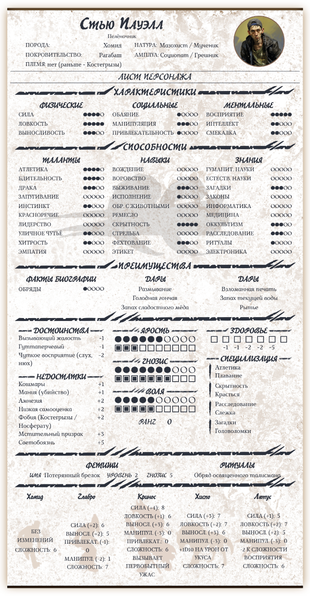
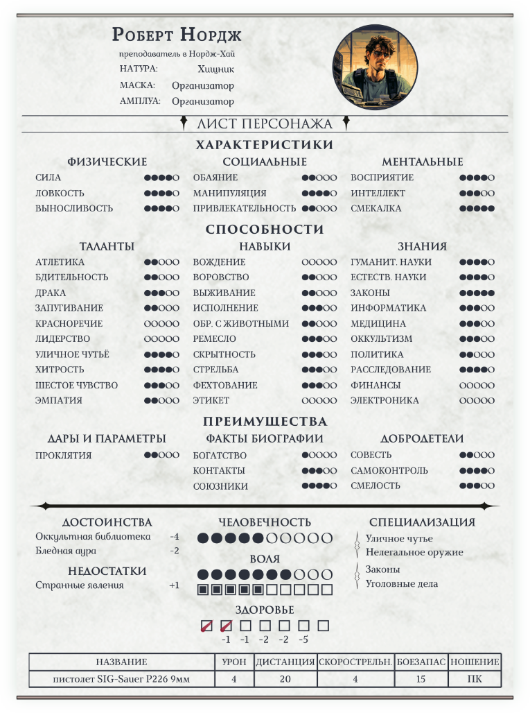
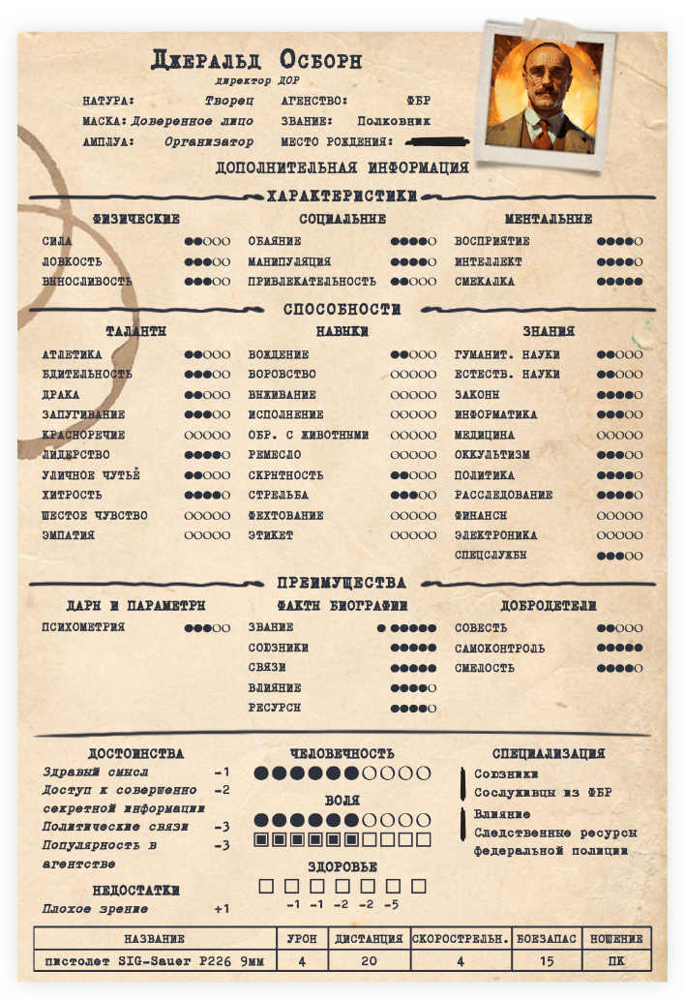

Несколько бланков персонажей старого Мира Тьмы (для двадцатой редакции, она же четвертая, она же "Классические правила"). Этакое дополнение, предназначенное для [Fantasy Statblocks](https://github.com/javalent/fantasy-statblocks) и [Obsidian](https://github.com/obsidianmd).
На данный момент, доступны бланки для **вампиров** (современность и темные века), **оборотней**, **смертных** и **правительственных агентов** (рескин смертных).

<p align="center">
    <a style='text-decoration: none' href="README.md"></a>
</p>

# Общее

## Вампиры
Для начала, пример бланка вампиров:

<p align="center">
    <a href='imgs/vampire_ru.png'></a>
    <a href='imgs/vampire_dark_ages_ru.png'></a>
</p>


## Оборотни, смертные и агенты

Под спойлером - остальные примеры.

<details>
    <summary>Оборотни</summary>
        <p align="center">
            <a href='imgs/werewolf_ru.png'></a>
        </p>
</details>

<details>
    <summary>Смертные</summary>
        <p align="center">
            <a href='imgs/mortal_ru.png'></a>
        </p>
</details>

<details>
    <summary>Правительственные агенты</summary>
        <p align="center">
            <a href='imgs/agent_ru.png'></a>
        </p>
</details>

## Заголовки/шапки

Также добавил возможность использовать только верхнюю часть листа как "шапку" заметки, если лист целиком по каким-то причинам не нужен. Просто оставьте пустыми все поля, за исключением "Основной информации", или добавьте `cssclasses: wod-header` к свойствам заметки.

<p align="center">
    
    
</p>
<p align="center">
    
    
</p>
<p align="center">
    
</p>

# Описание

За основу взят дизайн официальной русскоязычной версии бланков персонажа, выпущенных Студией 101. Статблок состоит из трех компонентов: сам файл статблока в формате JSON, CSS-сниппет и JS-скрипт.

**JSON + CSS**

- файл CSS содержит всю графику - красивые текстуры фонов, логотипы кланов, и так далее;
- все точки и квадраты - это отдельные кастомные шрифты (тоже хранятся внутри CSS), в которых заменены цифры. Соответственно, значения от 0 до 9 отображаются с легкостью (а в большинстве случаев нужно 5 или меньше); но вместо '10' нужно использовать 'Х' (английская или русская, строчная или прописная буква, без разницы), если не планируете запускать JS-скрипт;
- есть поддержка плагина [Dice Roller](https://github.com/javalent/dice-roller);
- в качестве значения для натуры, маски, амплуа, для названий дисциплин, достоинств и недостатков можно указывать ссылки на заметки внутри хранилища.

**JS-скрипт**

Он упрощает ряд моментов при заполнением листа, некоторые поля и вовсе автоматизирует, а также добавляет визуальных красивостей. Чуть подробней:
- перед статблоком можно добавить заголовок второго уровня (H2), совпадающий с именем персонажа - сам заголовок будет скрыт, но останется в оглавлении;
- логотип клана появится на фоне, если заполнено поле "Клан";
- аналогично будет заполнен и блок "Изъян";
- поле "Предел траты в ход" заполняется автоматически, в зависимости от значения в поле "Поколение";
- все Характеристики по умолчанию равны 1;
- если у параметра слишком длинное имя, а его значение превышает 5, точки могут быть заменены на цифры, чтобы дизайн не корёжило;
- если у вампира указан путь "Человечность", будет добавлен столп "Нормальность" и нужный (в зависимости от значения человечности) модификатор социальных взаимодействий; 
- можно спокойно писать '10' вместо 'Х' и не заморачиваться;
- в "Запас крови" будут добавляться новые строки, если значение больше 10, 20, и так далее. Максимум - 40; 

Почти все из вышеперечисленного можно заполнить вручную (кроме логотипа клана), так что скрипт нужен лишь для удобства.

> Для запуска скрипта нужен плагин [Obsidian Dataview](https://github.com/blacksmithgu/obsidian-dataview). 

## Некоторые ограничения
Все это началось как маленький проект для себя и группы друзей, с которыми мы играем в Мир Тьмы, так что на первом месте стоит, пожалуй, мое собственное удобство и интерес. Поэтому простор для кастомизации не так широк. Например, фиксированная ширина бланка - 680px, бланк нельзя разбить на несколько столбцов (верней, можно, но вся верстка поедет). С другой стороны, большинство полей скрываются, если не заполнены, так что бланк в любом случае не займет много места.

Также стоит упомянуть, что здесь полно говнокода :) Написание кода - лишь хобби, да и то, в каком-то смысле, вынужденное. Если есть замечания - пишите, или присылайте пулл-реквесты.

# Как пользоваться

## Пошаговая инструкция

1. Скачать три основных компонента: JSON для нужного персонажа, `world-of-darkness-statblocks.css`, и скрипт `WoDCharsheets.js` (или `WoDCharsheets-en.js` для английской версии);
2. Установить и включить плагин [Fantasy Statblocks](https://github.com/javalent/fantasy-statblocks);
3. Перейти в настройки Fantasy Statblocks и добавить JSON, нажав кнопку "Import From JSON". Новый пункт появвится в списке после дефолтных дндшных.
4. Скопировать `world-of-darkness-statblocks.css` в папку "snippets" внутри хранилища Obsidian, затем перейти в настройки Obsidian "Оформление" ->  "Фрагменты CSS кода", найти `world-of-darkness-statblocks.css` и включить его;
5. Скопировать `WoDCharsheets.js` (или `WoDCharsheets-en.js`) **в папку внутри хранилища Obsidian**;
6. Установить и включить плагин [Obsidian Dataview](https://github.com/blacksmithgu/obsidian-dataview);
7. Создать новую заметку;
8. В начале заметки добавить:
````
```dataviewjs
dv.executeJs(await dv.io.load("/z_Z manuals/WoDCharsheets.js"))
```
````
`"/z_Z manuals/WoDCharsheets.js"` - путь к JS-скрипту внутри моего хранилища Obsidian, нужно заменить на свой.

9.  Скопировать пустой шаблон нужного персонажа (ниже) и добавить его в заметку; 
10.  Готово! Можно начинать заполнять бланк.

<p align="center">
    
</p>

### Доступные статблоки

<details>
    <summary>Вампир</summary>

    ```statblock
    columnWidth: 680
    column: 1
    layout: VtM v20 Vampire
    dice: true

                            #### ОСНОВНАЯ ИНФОРМАЦИЯ ####

    name: 
    desc: 
    clan: 
    generation: 
    sire: 
    nature: 
    demeanor:  # Маска
    concept:  # Амплуа

    img: 
    img_title: 
    img_alt: 
    img_alt_title: 

                            #### ХАРАКТЕРИСТИКИ ####

    Attributes: ХАРАКТЕРИСТИКИ

    Physical: ФИЗИЧЕСКИЕ
    Strength: 1
    Dexterity: 1
    Stamina: 1

    Social: СОЦИАЛЬНЫЕ
    Charisma: 1
    Manipulation: 1
    Appearance: 1

    Mental: МЕНТАЛЬНЫЕ
    Perception: 1
    Intelligence: 1
    Wits: 1

                            #### СПОСОБНОСТИ ####

    Abilities: СПОСОБНОСТИ

    Talents: ТАЛАНТЫ
    athletics: 0
    alertness: 0 # Бдительность
    brawl: 0 # Драка
    intimidation: 0 # Запугивание
    expression: 0 # Красноречие
    leadership: 0
    streetwise: 0 # Уличное чутье
    subterfuge: 0 # Хитрость
    awareness: 0 # Шестое чувство
    empathy: 0
    new_talent: 
    new_talent_value: 

    Skills: НАВЫКИ
    drive: 0
    larceny: 0 # Воровство
    survival: 0
    performance: 0
    animalken: 0
    crafts: 0
    stealth: 0
    firearms: 0
    melee: 0
    etiquette: 0
    new_skill: 
    new_skill_value: 

    Knowledges: ЗНАНИЯ
    academics: 0
    science: 0
    law: 0
    computer: 0 # Информатика
    medicine: 0
    occult: 0
    politics: 0
    investigation: 0
    finance: 0
    technology: 0 # Электроника
    new_knowledge: 
    new_knowledge_value: 

                            #### ПРЕИМУЩЕСТВА ####

    Advantages: ПРЕИМУЩЕСТВА

    Disciplines: ДИСЦИПЛИНЫ
    discipline1_name: 
    discipline1_value: 
    discipline2_name: 
    discipline2_value: 
    discipline3_name: 
    discipline3_value: 
    discipline4_name: 
    discipline4_value: 
    discipline5_name: 
    discipline5_value: 
    discipline6_name: 
    discipline6_value: 

    Backgrounds: ФАКТЫ БИОГРАФИИ
    background1_name: 
    background1_value: 
    background2_name: 
    background2_value: 
    background3_name: 
    background3_value: 
    background4_name: 
    background4_value: 
    background5_name: 
    background5_value: 
    background6_name: 
    background6_value: 

    Virtues: ДОБРОДЕТЕЛИ
    conscience: 1
    selfcontrol: 1
    courage: 1

                        #### ДОСТОИНСТВА / НЕДОСТАТКИ ####

    Merits: ДОСТОИНСТВА
    merit1_name: 
    merit1_value: 
    merit2_name: 
    merit2_value: 
    merit3_name: 
    merit3_value: 
    merit4_name: 
    merit4_value: 
    merit5_name: 
    merit5_value: 
    merit6_name: 
    merit6_value: 
    merit7_name: 
    merit7_value: 

    Flaws: НЕДОСТАТКИ
    flaw1_name: 
    flaw1_value: 
    flaw2_name: 
    flaw2_value: 
    flaw3_name: 
    flaw3_value: 
    flaw4_name: 
    flaw4_value: 
    flaw5_name: 
    flaw5_value: 
    flaw6_name: 
    flaw6_value: 
    flaw7_name: 
    flaw7_value: 

                        #### ПУТЬ / ВОЛЯ / КРОВЬ ####

    Path: ЧЕЛОВЕЧНОСТЬ
    path_value: 0

    Willpower: ВОЛЯ
    willpower_main: 0
    willpower_current: 0

    Bloodpool: ЗАПАС КРОВИ
    blood: 0

    Health: Здоровье
    aggravated: 
    lethal: 
    bashing: 

                        #### СПЕЦИАЛИЗАЦИЯ ####

    Specialties: СПЕЦИАЛИЗАЦИЯ
    specialty1_origin: 
    specialty1_name: 
    specialty2_origin: 
    specialty2_name: 
    specialty3_origin: 
    specialty3_name: 
    specialty4_origin: 
    specialty4_name: 
    specialty5_origin: 
    specialty5_name: 
    specialty6_origin: 
    specialty6_name: 

    show_weakness: 

    ```

</details>

<details>
    <summary>Вампир (Темные века)</summary>

    ```statblock
    columnWidth: 680
    column: 1
    layout: VtM v20 Vampire Dark Ages
    dice: true

                            #### ОСНОВНАЯ ИНФОРМАЦИЯ ####

    name: 
    desc: 
    clan: 
    generation: 
    sire: 
    nature: 
    demeanor:  # Маска
    concept:  # Амплуа

    img: 
    img_title: 
    img_alt: 
    img_alt_title: 

                            #### ХАРАКТЕРИСТИКИ ####

    Attributes: ХАРАКТЕРИСТИКИ

    Physical: ФИЗИЧЕСКИЕ
    Strength: 1
    Dexterity: 1
    Stamina: 1

    Social: СОЦИАЛЬНЫЕ
    Charisma: 1
    Manipulation: 1
    Appearance: 1

    Mental: МЕНТАЛЬНЫЕ
    Perception: 1
    Intelligence: 1
    Wits: 1

                            #### СПОСОБНОСТИ ####

    Abilities: СПОСОБНОСТИ

    Talents: ТАЛАНТЫ
    athletics: 
    alertness: 0 # Бдительность
    brawl: 0 # Драка
    intimidation: 0 # Запугивание
    expression: 0 # Красноречие
    leadership: 0
    legerdemain: 0 # Ловкость рук
    subterfuge: 0 # Хитрость
    awareness: 0 # Шестое чувство
    empathy: 0
    new_talent: 
    new_talent_value: 

    Skills: НАВЫКИ
    ride: 0 # Верховая езда
    survival: 2
    performance: 0
    commerce: 0 # Коммерция
    animalken: 0
    crafts: 0
    stealth: 0
    archery: 0 # Стрельба из лука
    melee: 0
    etiquette: 0
    new_skill: 
    new_skill_value: 

    Knowledges: ЗНАНИЯ
    enigmas: 0 # Головоломки
    academics: 0
    hearthwisdom: 0 # Житейская мудрость
    law: 0
    medicine: 0
    occult: 0
    politics: 0
    seneschal: 0
    investigation: 0
    theology: 0
    new_knowledge: 
    new_knowledge_value: 

                            #### ПРЕИМУЩЕСТВА ####

    Advantages: ПРЕИМУЩЕСТВА

    Disciplines: ДИСЦИПЛИНЫ
    discipline1_name: 
    discipline1_value: 
    discipline2_name: 
    discipline2_value: 
    discipline3_name: 
    discipline3_value: 
    discipline4_name: 
    discipline4_value: 
    discipline5_name: 
    discipline5_value: 
    discipline6_name: 
    discipline6_value: 

    Backgrounds: ФАКТЫ БИОГРАФИИ
    background1_name: 
    background1_value: 
    background2_name: 
    background2_value: 
    background3_name: 
    background3_value: 
    background4_name: 
    background4_value: 
    background5_name: 
    background5_value: 
    background6_name: 
    background6_value: 

    Virtues: ДОБРОДЕТЕЛИ
    conscience: 1
    selfcontrol: 1
    courage: 1

                        #### ДОСТОИНСТВА / НЕДОСТАТКИ ####

    Merits: ДОСТОИНСТВА
    merit1_name: 
    merit1_value: 
    merit2_name: 
    merit2_value: 
    merit3_name: 
    merit3_value: 
    merit4_name: 
    merit4_value:
    merit5_name: 
    merit5_value: 
    merit6_name: 
    merit6_value: 
    merit7_name: 
    merit7_value: 

    Flaws: НЕДОСТАТКИ
    flaw1_name: 
    flaw1_value: 
    flaw2_name: 
    flaw2_value: 
    flaw3_name: 
    flaw3_value: 
    flaw4_name: 
    flaw4_value: 
    flaw5_name: 
    flaw5_value: 
    flaw6_name: 
    flaw6_value: 
    flaw7_name: 
    flaw7_value: 

                        #### ПУТЬ / ВОЛЯ / КРОВЬ ####

    Road: ДОРОГА
    road_name: 0
    road_value: 
    aura: 

    willpower: ВОЛЯ
    willpower_main: 0
    willpower_current: 0

    bloodpool: ЗАПАС КРОВИ
    blood: 0

    Health: ЗДОРОВЬЕ
    aggravated: 
    lethal: 
    bashing: 

                        #### СПЕЦИАЛИЗАЦИЯ ####


    Specialties: СПЕЦИАЛИЗАЦИЯ
    specialty1_origin: 
    specialty1_name: 
    specialty2_origin: 
    specialty2_name: 
    specialty3_origin: 
    specialty3_name: 
    specialty4_origin: 
    specialty4_name: 
    specialty5_origin: 
    specialty5_name: 
    specialty6_origin: 
    specialty6_name: 

    show_weakness:
    ```

</details>

<details>
    <summary>Оборотень</summary>

    ```statblock
    columnWidth: 680
    column: 1
    layout: WtA v20 Werewolf
    dice: true

                            #### ОСНОВНАЯ ИНФОРМАЦИЯ ####

    name: 
    desc: 
    breed: 
    auspice: 
    tribe: 
    pack_name: 
    totem: 
    nature: 
    demeanor:  # Маска
    concept:  # Амплуа

    img: 
    img_title: 
    img_alt: 
    img_alt_title: 

                                #### ХАРАКТЕРИСТИКИ ####

    Attributes: ХАРАКТЕРИСТИКИ

    Physical: ФИЗИЧЕСКИЕ
    Strength: 1
    Dexterity: 1
    Stamina: 1

    Social: СОЦИАЛЬНЫЕ
    Charisma: 1
    Manipulation: 1
    Appearance: 1

    Mental: МЕНТАЛЬНЫЕ
    Perception: 1
    Intelligence: 1
    Wits: 1

                                #### СПОСОБНОСТИ ####

    Abilities: СПОСОБНОСТИ

    Talents: ТАЛАНТЫ
    athletics: 0 # Атлетика
    alertness: 0 # Бдительность
    brawl: 0 # Драка
    intimidation: 0 # Запугивание
    expression: 0 # Красноречие
    leadership: 0
    primalurge: 0 # Первобытный инстинкт
    streetwise: 0 # Уличное чутье
    subterfuge: 0 # Хитрость
    empathy: 0
    new_talent: 
    new_talent_value: 

    Skills: НАВЫКИ
    drive: 0
    larceny: 0 # Воровство
    survival: 0
    performance: 0
    animalken: 0
    crafts: 0
    stealth: 0
    firearms: 0
    melee: 0
    etiquette: 0
    new_skill:
    new_skill_value:

    Knowledges: ЗНАНИЯ
    academics: 0
    science: 0
    enigmas: 0 # Загадки
    law: 0
    computer: 0
    medicine: 0
    occult: 0
    rituals: 0 # Ритуалы
    investigation: 0
    technology: 0
    new_knowledge:
    new_knowledge_value:

                            #### ПРЕИМУЩЕСТВА ####

    Advantages: ПРЕИМУЩЕСТВА

    Backgrounds: ФАКТЫ БИОГРАФИИ
    background1_name: 
    background1_value: 
    background2_name: 
    background2_value: 
    background3_name: 
    background3_value: 
    background4_name: 
    background4_value: 
    background5_name: 
    background5_value: 
    background6_name: 
    background6_value: 

    Gifts: ДАРЫ
    gift1: 
    gift2: 
    gift3: 
    gift4: 
    gift5: 
    gift6: 
    gift7: 
    gift8: 
    gift9: 
    gift10: 

                        #### ДОСТОИНСТВА / НЕДОСТАТКИ ####

    where-to-show-merits-and-flaws: right

    Merits: ДОСТОИНСТВА
    merit1_name: 
    merit1_value: 
    merit2_name: 
    merit2_value: 
    merit3_name: 
    merit3_value: 
    merit4_name: 
    merit4_value: 
    merit5_name: 
    merit5_value: 

    Flaws: НЕДОСТАТКИ
    flaw1_name: 
    flaw1_value: 
    flaw2_name: 
    flaw2_value: 
    flaw3_name: 
    flaw3_value: 
    flaw4_name: 
    flaw4_value: 
    flaw5_name: 
    flaw5_value:

                            #### ПОЧЕТ / ВОЛЯ / ЗДОРОВЬЕ ####

    Renown: Почет

    Glory: Слава
    glory_main: 0
    glory_current: 0

    Honor: Честь
    honor_main: 0
    honor_current: 0

    Wisdom: Мудрость
    wisdom_main: 0
    wisdom_current: 0

    Rage: Ярость
    rage_main: 0
    rage_current: 0

    Gnosis: Гнозис
    gnosis_main: 0
    gnosis_current: 0

    willpower: ВОЛЯ
    willpower_main: 0
    willpower_current: 0

    Health: ЗДОРОВЬЕ
    aggravated: 
    lethal: 
    bashing: 

                            #### СПЕЦИАЛИЗАЦИЯ ####

    Specialties: СПЕЦИАЛИЗАЦИЯ
    specialty1_origin: 
    specialty1_name: 
    specialty2_origin: 
    specialty2_name: 
    specialty3_origin: 
    specialty3_name: 
    specialty4_origin: 
    specialty4_name: 
    specialty5_origin: 
    specialty5_name: 
    specialty6_origin: 
    specialty6_name: 
    ```

</details>

<details>
    <summary>Смертный</summary>

    ```statblock
    columnWidth: 680
    column: 1
    layout: WoD v20 Mortal
    dice: true

                            #### ОСНОВНАЯ ИНФОРМАЦИЯ ####

    name: 
    desc: 
    nature: 
    demeanor:  # Маска
    concept:  # Амплуа

    img: 
    img_title: 
    img_alt: 
    img_alt_title: 

                            #### ХАРАКТЕРИСТИКИ ####

    Attributes: Характеристики

    Physical: ФИЗИЧЕСКИЕ
    Strength: 1
    Dexterity: 1
    Stamina: 1

    Social: СОЦИАЛЬНЫЕ
    Charisma: 1
    Manipulation: 1
    Appearance: 1

    Mental: МЕНТАЛЬНЫЕ
    Perception: 1
    Intelligence: 1
    Wits: 1

                                #### СПОСОБНОСТИ ####

    Abilities: СПОСОБНОСТИ

    Talents: ТАЛАНТЫ
    athletics: 0 # Атлетика
    alertness: 0 # Бдительность
    brawl: 0 # Драка
    intimidation: 0 # Запугивание
    expression: 0 # Красноречие
    leadership: 0
    streetwise: 0 # Уличное чутье
    subterfuge: 0 # Хитрость
    awareness: 0 # Шестое чувство
    empathy: 0
    new_talent: 
    new_talent_value: 

    Skills: НАВЫКИ
    drive: 0
    larceny: 0 # Воровство
    survival: 0
    performance: 0
    animalken: 0
    crafts: 0
    stealth: 0
    firearms: 0
    melee: 0
    etiquette: 0
    new_skill: 
    new_skill_value: 

    Knowledges: ЗНАНИЯ
    academics: 0
    science: 0
    law: 0
    computer: 0 # Информатика
    medicine: 0
    occult: 0
    politics: 0
    investigation: 0
    finance: 0
    technology: 0 # Электроника
    new_knowledge:
    new_knowledge_value:

                                #### ПРЕИМУЩЕСТВА ####

    Advantages: ПРЕИМУЩЕСТВА

    Numina: NUMINA
    numina1_name: 
    numina1_value: 
    numina2_name: 
    numina2_value: 
    numina3_name: 
    numina3_value: 
    numina4_name: 
    numina4_value: 
    numina5_name: 
    numina5_value: 
    numina6_name: 
    numina6_value: 

    Backgrounds: ФАКТЫ БИОГРАФИИ
    background1_name: 
    background1_value: 
    background2_name: 
    background2_value: 
    background3_name: 
    background3_value: 
    background4_name: 
    background4_value: 
    background5_name: 
    background5_value: 
    background6_name: 
    background6_value: 

    Virtues: ДОБРОДЕТЕЛИ
    conscience: 1
    selfcontrol: 1
    courage: 1

                        #### ДОСТОИНСТВА / НЕДОСТАТКИ ####

    Merits: ДОСТОИНСТВА
    merit1_name: 
    merit1_value: 
    merit2_name: 
    merit2_value: 
    merit3_name: 
    merit3_value: 
    merit4_name: 
    merit4_value: 
    merit5_name: 
    merit5_value: 
    merit6_name: 
    merit6_value: 

    Flaws: НЕДОСТАТКИ
    flaw1_name: 
    flaw1_value: 
    flaw2_name: 
    flaw2_value: 
    flaw3_name: 
    flaw3_value: 
    flaw4_name: 
    flaw4_value: 
    flaw5_name: 
    flaw5_value: 
    flaw6_name: 
    flaw6_value: 

                        #### ЧЕЛОВЕЧНОСТЬ / ВОЛЯ / ЗДОРОВЬЕ ####

    humanity: ЧЕЛОВЕЧНОСТЬ
    humanity_value: 0

    willpower: ВОЛЯ
    willpower_main: 0
    willpower_current: 0 

    Health: ЗДОРОВЬЕ
    bashing: 0
    lethal: 0

                                #### СПЕЦИАЛИЗАЦИЯ ####

    Specialties: СПЕЦИАЛИЗАЦИЯ
    specialty1_origin: 
    specialty1_name: 
    specialty2_origin: 
    specialty2_name: 
    specialty3_origin: 
    specialty3_name: 
    specialty4_origin: 
    specialty4_name: 
    specialty5_origin: 
    specialty5_name: 
    specialty6_origin: 
    specialty6_name: 

                                    #### ОРУЖИЕ ####

    weapon1_name: 
    damage1: 
    range1: 
    firerate1: 
    clip1: 
    conceal1: 

    weapon2_name: 
    damage2: 
    range2: 
    firerate2: 
    capacity2: 
    conceal2: 

    weapon3_name: 
    damage3: 
    range3: 
    firerate3: 
    capacity3: 
    conceal3: 

    weapon4_name: 
    damage4: 
    range4: 
    firerate4: 
    capacity4: 
    conceal4: 
    ```

</details>

<details>
    <summary>Правительственный агент</summary>

    ```statblock
    column: 1
    columnWidth: 680
    layout: WoD v20 Agent
    dice: true

                            #### ОСНОВНАЯ ИНФОРМАЦИЯ ####

    name: 
    desc: 
    nature: 
    demeanor:  # Маска
    concept:  # Амплуа
    agency: 
    rank: 
    codename: 

    img: 
    img_title: 
    img_alt: 
    img_alt_title: 

                            #### ХАРАКТЕРИСТИКИ ####

    Attributes: ХАРАКТЕРИСТИКИ

    Physical: ФИЗИЧЕСКИЕ
    Strength: 1
    Dexterity: 1
    Stamina: 1

    Social: СОЦИАЛЬНЫЕ
    Charisma: 1
    Manipulation: 1
    Appearance: 1

    Mental: МЕНТАЛЬНЫЕ
    Perception: 1
    Intelligence: 1
    Wits: 1

                                #### СПОСОБНОСТИ ####

    Abilities: СПОСОБНОСТИ

    Talents: ТАЛАНТЫ
    athletics: 0 # Атлетика
    alertness: 0 # Бдительность
    brawl: 0 # Драка
    intimidation: 0 # Запугивание
    expression: 0 # Красноречие
    leadership: 0
    streetwise: 0 # Уличное чутье
    subterfuge: 0 # Хитрость
    awareness: 0 # Шестое чувство
    empathy: 0
    new_talent: 
    new_talent_value: 

    Skills: НАВЫКИ
    drive: 0
    larceny: 0 # Воровство
    survival: 0
    performance: 0
    animalken: 0
    crafts: 0
    stealth: 0
    firearms: 0
    melee: 0
    etiquette: 0
    new_skill: 
    new_skill_value: 

    Knowledges: ЗНАНИЯ
    academics: 0
    science: 0
    law: 0
    computer: 0 # Информатика
    medicine: 0
    occult: 0
    politics: 0
    investigation: 0
    finance: 0
    technology: 0 # Электроника
    new_knowledge: 
    new_knowledge_value: 

                                #### ПРЕИМУЩЕСТВА ####

    Advantages: ПРЕИМУЩЕСТВА

    Numina: ДАРЫ И ПАРАМЕТРЫ
    numina1_name: 
    numina1_value: 
    numina2_name: 
    numina2_value: 
    numina3_name: 
    numina3_value: 
    numina4_name: 
    numina4_value: 
    numina5_name: 
    numina5_value: 
    numina6_name: 
    numina6_value: 

    Backgrounds: ФАКТЫ БИОГРАФИИ
    background1_name: 
    background1_value: 
    background2_name: 
    background2_value: 
    background3_name: 
    background3_value: 
    background4_name: 
    background4_value: 
    background5_name: 
    background5_value: 
    background6_name: 
    background6_value: 

    Virtues: ДОБРОДЕТЕЛИ
    conscience: 1
    selfcontrol: 1
    courage: 1

                        #### ДОСТОИНСТВА / НЕДОСТАТКИ ####

    Merits: ДОСТОИНСТВА
    merit1_name: 
    merit1_value: 
    merit2_name: 
    merit2_value: 
    merit3_name: 
    merit3_value: 
    merit4_name: 
    merit4_value: 

    Flaws: НЕДОСТАТКИ
    flaw1_name: 
    flaw1_value: 
    flaw2_name: 
    flaw2_value: 
    flaw3_name: 
    flaw3_value: 
    flaw4_name: 
    flaw4_value: 
    flaw5_name: 
    flaw5_value: 
    flaw6_name: 
    flaw6_value: 
    flaw7_name: 
    flaw7_value: 


                        #### ЧЕЛОВЕЧНОСТЬ / ВОЛЯ / ЗДОРОВЬЕ ####


    Humanity: ЧЕЛОВЕЧНОСТЬ
    humanity_value: 0

    Willpower: ВОЛЯ
    willpower_main: 0
    willpower_current: 0

    Health: ЗДОРОВЬЕ
    bashing: 0
    lethal: 0

                                #### СПЕЦИАЛИЗАЦИЯ ####

    Specialties: СПЕЦИАЛИЗАЦИЯ
    specialty1_origin: 
    specialty1_name: 
    specialty2_origin: 
    specialty2_name: 
    specialty3_origin: 
    specialty3_name: 
    specialty4_origin: 
    specialty4_name: 
    specialty5_origin: 
    specialty5_name: 
    specialty6_origin: 
    specialty6_name: 

                                    #### ОРУЖИЕ ####

    weapon1_name: 
    damage1: 
    range1: 
    firerate1: 
    clip1: 
    conceal1: 

    weapon2_name: 
    damage2: 
    range2: 
    firerate2: 
    capacity2: 
    conceal2: 

    weapon3_name: 
    damage3: 
    range3: 
    firerate3: 
    capacity3: 
    conceal3: 

    weapon4_name: 
    damage4: 
    range4: 
    firerate4: 
    capacity4: 
    conceal4: 
    ```

</details>

## Часто задаваемые вопросы

**В**: Зачем мне запускать непонятный JS-скрипт внутри моего хранилища Obsidian?
<br>
**О**: В целом, можно обойтись без него и использовать только CSS-файл. Без скрипта:
- не появится логотип клана на фоне;
- обязательно нужно будет использовать 'Х' вместо '10';
- нужно вручную добавить ряд полей, а именно `bearing` (столп и его значение), `blood_per_turn` (предел траты крови в ход) и, при необходимости, `blood_current2`, `blood_current3`, `blood_current4` (значения соответственно второй, третьей и четвертой строчки крови).

**В**: Когда я добавляю JSON в Fantasy Statblock, появляется сообщение о JS-скрипте внутри! Что это?
<br>
**О**: Внутри О JSON'a есть много простых блоков кода, чтобы можно было кидать кубы, если установлен плагин [Dice Roller](https://github.com/javalent/dice-roller). 

**В**: В моем статблоке нет шрифтов, которые есть на скриншотах! 
<br>
**О**: Я не могу добавить шрифты в репозиторий, это было бы нарушением правил площадки. Но вы можете найти их отдельно и установить на свой компьютер, тогда статблок их подхватит.<br>
Для вампиров и смертных, используются шрифты Marta и Trajan Pro 3.<br>
Для вампиров темных веков - Lidia и PT Serif Pro.<br>
Для оборотней - Marta and KistyCC.<br>
Для агентов - GNUTypewriter.<br>
А еще статблок поддерживает замечательный плагин [Style Settings](https://github.com/mgmeyers/obsidian-style-settings/), так что можно заменить указанные шрифты на любые другие (если они так же установлены).
<p align="center">
    
</p>

<!--
**Q**: Alright, I did it, but still can't see the fonts on my mobile!
<br>
**A**: -->

**В**: У моего вампира поле "Изъян" пустое! 
<br>
**О**: Я не могу добавить такие длинные цитаты из правил, правообладатели против. Но в начале JS-скрипта есть специальные поля для изънов всех кланов, например, `const weaknessBrujah = '';`. Откройте скрипт (например, блокнотом) и добавьте текст изъяна между кавычками. <br> Или просто добавьте в статблок поле `weakness` и нужный текст для него. Этот способ также подойдет, если вы не используете JS-скрипт.

**В**: CSS-файл размером 10 мегабайт? Не слишком ли много?
<br>
**О**: В файле хранится все графические элементы (в кодировке base64) для всех статблоков, особенно много места занимают фоновые текстуры. Все это я разместил в самом конце файла, и заодно разбил на блоки с комментариями вида `/*  ВСЕ ГРАФИЧЕСКИЕ МАТЕРИАЛЫ ДЛЯ АГЕНТОВ  */`. Если, например, вам нужны только вампиры, то подобные блоки для других персонажей можно смело удалить. 

## Эпилог 
В общем-то, все! Пишите, что думаете про этот статблок, и как его можно улучшить.
Сейчас, например, мне не очень нравится отображение специализаций, но варианта получше придумать пока не удалось.
Было бы также здорово иметь возможность делать бросок кубов полностью по правилам Storytelling, объединяя характеристики и способности; но, похоже, пока это технически невозможно.